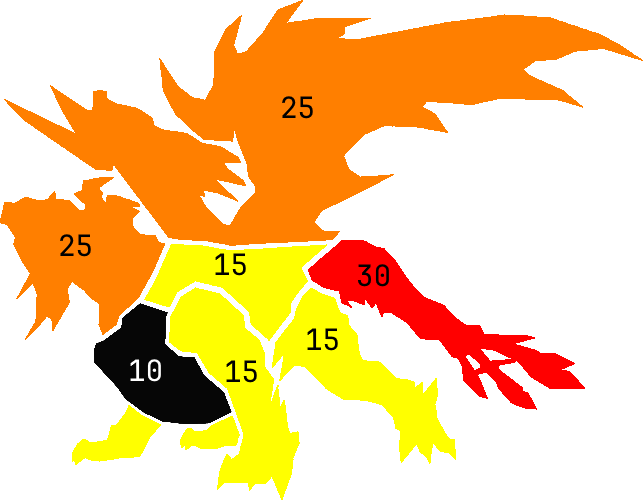
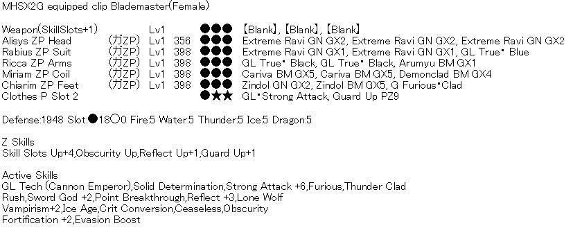
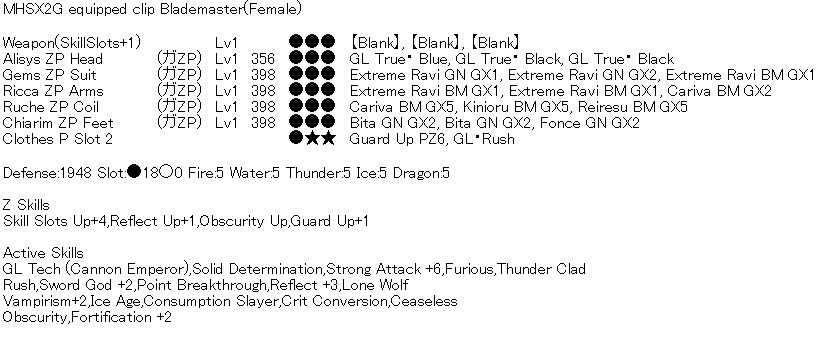
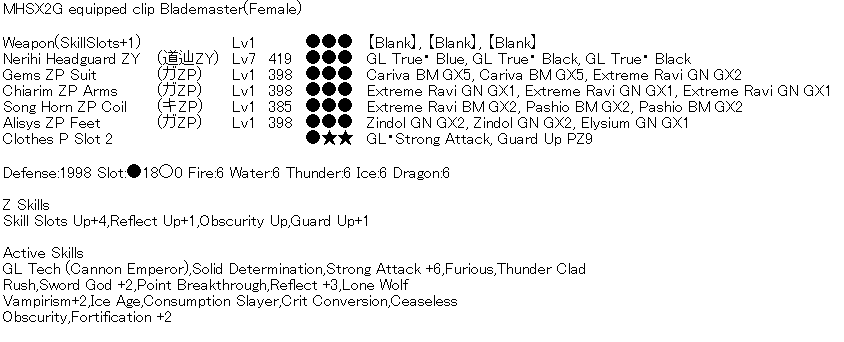
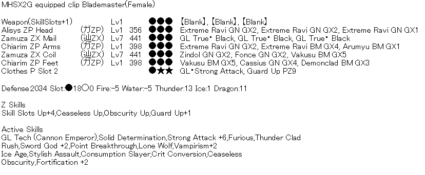
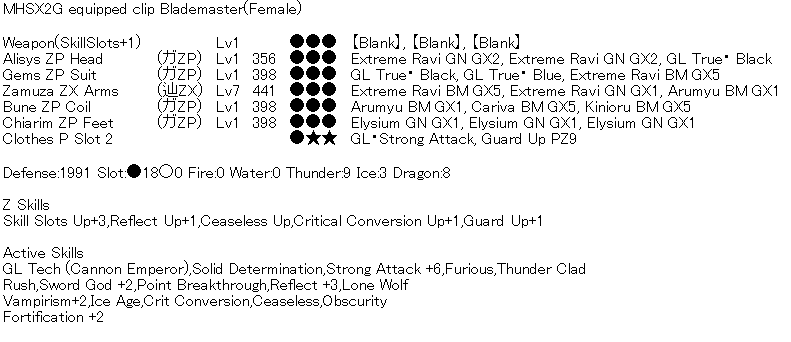

# Data
## Hitzones

| *Part*       | *Cutting*                             | *Impact* | *Shot* | *Fire* | *Water* | *Thndr* | *Dragon* | *Ice* |
| ------------ | ------------------------------------- | -------- | ------ | ------ | ------- | ------- | -------- | ----- |
| **Head**     | <mark style="color:Orange;">25</mark> | 30       | 30     | 10     | 5       | 0       | 20       | 25    |
| **Belly**    | 10                                    | 15       | 10     | 10     | 5       | 0       | 5        | 5     |
| **Back**     | 15                                    | 10       | 15     | 10     | 5       | 0       | 5        | 5     |
| **Tail**     | <mark style="color:Red;">30</mark>    | 25       | 25     | 10     | 5       | 0       | 15       | 15    |
| **Foreleg**  | 15                                    | 20       | 10     | 10     | 5       | 0       | 10       | 5     |
| **Hind Leg** | 15                                    | 15       | 10     | 10     | 5       | 0       | 10       | 5     |
| **Wing**     | <mark style="color:Orange;">25</mark> | 20       | 15     | 10     | 5       | 0       | 15       | 20    |
- Base HP: 6000x5 = 30000
- Def Mod: 0.04
- ~~Rage Def Mod: 0.6~~
## Reference Runs
#### [Hygogg12](https://www.youtube.com/watch?v=68WK1F69fMo)
- 15 + 110 attack sigils
- Weapon Art Lg + PD Lg
- Incitement Guild Food
- ~25s for Thunderclad
- ~37s for Furious 3
- Wing break ~5:42
- 50% ~5 mins
- 20% ~8 mins
- Dure kept spamming tackle combo towards the end

| **Move**       | **Count**        |
| -------------- | ---------------- |
| Tackle Combo   | 18               |
| Tail Slam      | 16 (11 Reflects) |
| 4 Beam         | 9                |
| Slam Roar      | 8                |
| Charge 2x Roar | 6                |
| Tail Tremor    | 4                |
| Cross          | 4                |
| Paw Slam       | 3                |
| Air Nova       | 3                |
| Ground Nova    | 2                |
| Tackle Roar    | 2                |
| Beam           | 1                |
| Sweep Beam     | 1                |
| Hop Combo      | 1                |
#### [MHいつも](https://www.youtube.com/watch?v=xEwV5ftK6Ig)
- Doesn't use Evasion Boost
- Not maxed evo?! (Doesn't show gear/skills)
	- Probably Lavish+LW 
	- No CeaseUp
- Wing break faster than 5 minutes (~6:25 remaining)
- ~11s for Thunderclad
- ~41s for Furious 3
- 50% ~5 mins
- 20% 8:05 (Staggers nuke, probably bad since nuke is free damage)
- ~9:52 clear
- Actually uses overhead slam
- Stays at side of hindleg -> Waist hits

| **Move**       | **Count**      |
| -------------- | -------------- |
| Tackle Combo   | 12             |
| Tail Slam      | 9 (7 Reflects) |
| Charge 2x Roar | 9              |
| Paw Slam       | 9              |
| Tail Tremor    | 7              |
| 4 Beam         | 6              |
| Slam Roar      | 6              |
| Air Nova       | 6              |
| Cross          | 4              |
| Ground Nova    | 2              |
| Beam           | 2              |
| Tackle Roar    | 1              |
| Sweep Beam     | 1              |
| Hop Combo      | 1              |
## Sets
- ?Reflect probably still necessary to keep up DPS?
- Ravi Clear: 800 raw, 100% affinity
- Sigils: 15 GL Up + 91 Attack = 106 (MAX: 15 + 120 = 135) 
- Ice Age: 1/4/5 DPS
- Weapon Art Lg (+40 raw) + Perfect Defense Large
### Evade Boost

- Evasion Boost to deal with Dure's agility (4-beam, 2xhop > beam, tackle > beam > tackle)
- Lone Wolf instead of Lavish Attack (Can't have diva so LW is just better)
	- ?Maybe go Lavish + Attack cat?

### Lance sets

- +100 raw over Evasion Boost set while incite isn't up, +60 otherwise
- 12% timeout

### No Reflect

- Trades Reflect for Ceaseless Up and Stylish Assault
- Highest stab damage output
- From PANINI
- 18% and 19% timeout
- More evades → Less poison + faster Thunderclad → Easier to stay alive
- Losing reflect damage seems to be significant

### No Obscurity Up

- Trades SSU+1 and Obscurity Up for Ceaseless Up and Crit Conversion Up
- Based on Kotya's clear (PROBABLY used a Z sigil)
- Loses 50 raw vs lavish
- ?How much sharpness do you lose in-between heatblades?
	- At most 4 HB → definitely drop to purple
	- Negligible if HB can be recovered on CD 
# Notes
- Pure reflect playstyle doesn't work (unless you can PD every single beam hit → Turbo/TAS?)
- Uptime is king!
- *Tail* (30) > *Head* = *Wing* (25) > *Back* = *Legs* (15* > *Belly/Body* (10)
	- The *Belly* (*Body* on overlay) hitbox seems to be only a thin shell → As long as you are close it'll hit the *Back* instead
	- Guard-pokes will usually hit *Back* hitbox (HB basically always)
		- Hitting back causes part damage on wings?!
	- Getting PBT on *Back* has the most consistent damage increase since you can hit it from any angle 
	- ~~PBT on back legs most consistent if Dure jumps a lot~~
	- ~~Hitting wing consistently for PBT not possible?~~
		- ~~Turns out Dure's hurtboxes are wonky and GL's hitbox is pretty far
		- ~~Wing hitboxes are also MASSIVE and move a lot during animations e.g. during Turn-around Swipe Guard-Pokes reach them
		- ~~Can hit wings somewhat consistently by Guard-poking while being close to Dure~~
			- ~~Front: Through chest into back/wings~~
			- ~~Back/Side: Towards the waist~~
			- ~~Upswing and Slam both tend to hit wing or tail~~
		- ~~**Staying at Dure's side seems to yield best DPS**~~
		- ~~Generally you want to be somewhere in the middle of the body or a the hindleg and poke towards the waist~~
	- ~~?Guard-poke at arm/wing/back → Real hit on arm, HB hit on wing/back?~~	
	- *Head* and *Tail* not always accessible
		- Going directly in front might also cause iffy attack selection (e.g. spamming paw-slam) and Slam > Charge > Roar becomes much more dangerous
		- *Head* hitbox is awkward if close to Dure (tends to hit *Body*)
		- *Tail* hits are great if the opening is small or from reflects
		- Upswing is your best friends for quick damage (especially *Tail* hits)
- Can restore HB after most attack sequences (safest after/during any beam or after tackle sequence) 
- You'll be poisoned a LOT during the fight
	- Any attack with electric rocks or beams inflicts poison
	- Poisons through guards/parries
	- Poison takes a bit before it starts ticking and re-poisoning doesn't refresh duration
	- With full road skills poison deals <40 damage?
	- ~~Generally if you have ticking poison you want to evade everything, even PD'able things since chip means death~~
	- If poison hasn't started ticking yet you can still safely PD
	- Just accept that turn-around swipes will kill you occasionally 
- Every slam has a big hitbox around Dure that poisons + z-tremor → 2 Reflect triggers BUT need to PD the tremor 
	- ?They might be offset from each other?
- Dure's roar has very short range: Radius approx. from its head to tail-base
- **PDs are really important!** Generally late timings, since the PD has to catch the z-tremors
- ROAD ATTACK WORKS?!
## Attacks
- **Opener**
	- Courage: PD roar > 4 guard-pokes > PD Nuke (Full obs, Full guard for Furious)
	- Weapon Art Lg: Blast-dash roar > Cleave > Poke > Upswing > Guard-poke > PD Nuke > 2 Guard-pokes > Upswing > Slam > Guard/Guard-poke 
	- Sometimes Dure spawns early, so you can't evade the roar → No Thunderclad/Furious build-up
		- Worst opening: Early Spawn → 4-Beam
	- ?Maybe hop nuke for earlier Thunderclad? 
- **Threshold Nuke**
	- Ideally PD roar > 4 Guard-pokes > PD Explosion
	- But just not getting hit by roar is good enough 
	- Wing discharge can hit grounded → Stay towards middle
- **Paw-slam > Spin**
	- PD > PD
		- If close: Face away from Dure for slam to not get tripped
		- Pretty big gap between PDs
	- Backhop > delayed back-dash
	- Stupidly fast, but not really dangerous since chip is negligible (unless you have ticking poison)
	- Hind legs will be further away after the animation completes!
- **4-Beam**
	- Get behind with run > blast-dash 
		- Left side is safer, right side gives you a tail-hit if you time a Blast-Dash > Cleave with the second Beam 
	- If too far/no EE time blast-dash with side beams otherwise you'll get clipped
		- Timing without EE is quite tight if Dure slides backwards
	- If left: Stay at back leg (might have to sidestep to not get clipped by the sweep)
	- If right: Don't stand where the beam starts
	- Usually enough time for any stab combo + slam
	- Has a hitbox when Dure lands from backhop!
	- ?There might be a reflect strat where you stand at the edge of where the sweeping beam starts?
- **Tail-tremor > Spin**
	- PD tremor (late, don't change facing while Dure spins)
	- If far: PD spin xx sidestep rocks
	- If poison is ticking, failing any PD usually means death
	- Dure tends to do this if you are far-ish and in front 
	- If you are close to a foreleg you can get a second reflect from the spin
		- Direction is wonky though, so you might get tripped
	- [If you are next to the initial tail hit you can get a ton of reflects](https://www.youtube.com/watch?v=0bBTIDK5_uE) 
- **Tackle > Beam > Tackle**
	- PD Tackle > Blast-dash > delayed hop (~End of blast-dash recovery)
		- Hop/Sidestep > Blast-dash > delayed hop if you are in an animation when tackle starts
	- Second tackle is along the same path as the first one 
	- Ideally you blast-dash away from Dure in tackle direction
	- Large source of DPS loss if you misjudge the direction and end up far
	- Initial tackle can trigger multiple reflects if very close (start-up + movement) 
	- Real ass if Dure does it close to a wall cause the hop timing is earlier and you might end up blast-dashing with/into the beam
- **Hop > Hop > Beam**
	- PD hops if you can (they usually miss) > Blast-dash towards Dure
- **Backstep > Jumping Tail-swipe** 
	- PD or hop depending on TC status
- **Slam > Straight Beam / Sweep Beam**
	- Run > Blast-dash behind Dure (side doesn't matter)
		- When behind stay in the middle to not get clipped by wing discharge
	- Run > Blast-dash parallel to Dure (stay at side)
		- Being between front and backlegs is safe from wing-discharge
	- Late evasion to avoid tremor, but timing is not that tight
	- Sweep starts later and a bit further towards the safe side (not straight ahead)
	- PD'ing the tremor/blast is too risky
	- ?Enough time for full combo?
	- Wing discharge can hit grounded → Stay in the middle OR blast-dash > cleave late to evade
- **Slam > Charge > Roar+Explosion**
	- PD > guard-poke > PD
		- Second part doesn't need PD if outside of roar range
		- Very slight delay between guard-poke and PD
	- Roar is short ranged
	- If you miss first PD, mashing Blast-dash auto-evades explosion
	- Blast-dash > Cleave > Hop
		- Fallback if poison would kill you
		- Hop at the very end of the cleave animation
	- Really sucks if you are in front of Dure because of the roar hit
- **Tail-slam**
	- If close: PD 
		- If really close: Upswing > Guard-poke > Upswing
		- Else: 
			- Cancel into run > Blast-dash > Cleave
	- If far: Blast-dash > Cleave (> Run > Poke)
- **Back-flip rocks > Dive** 
	- Backhop rocks > PD dive
	- Block/PD rocks > PD dive
		- Reflect on rocks usually whiffs
	- Dive nets multiple reflects 
	- If Dure gets staggered in the dive it'll snap to flying-idle > land animation 
		- This can break the AI and get Dure stuck (KO unsticks, ?Stagger doesn't?)
- **Charge > Ground-roar > Slam**
	- Just hit Dure during this
	- n Guard-poke > PD > PD
	- If you are very close to Dure for the slam missing the PD won't cause a knockback (still chips though)
- **Charge > Air Nova**
	- Nova is unblockable
	- Poke during charge
		- Poke > Side-step
		- Guard-poke > Blast-dash towards tail/side
	- Try to hit tail during recovery if behind
		- Upswing > Guard-poke only if you won't get clipped by Turn-around Swipe
- **Charge > Right paw-slam > Left paw-slam**
	- 4 guard-pokes > PD > guard-poke > PD
		- Slams are multi-hit → Single PD *can* cover 2+ hits, BUT it's not guaranteed
	- Guard-poke in between feels risky, but basically auto-times the second PD
	- ~~Aim towards side so reflect hits forelegs rather than body (head's too high)~~
		- Doesn't seem matter since it'll usually hit the back if you are point-blank
- **Cross explosions > Slam**
	- Safe at back legs or directly under Dure
	- If in safe spot: 3 guard-poke (Ignore cross) > PD Slam 
	- Otherwise guard cross (usually hits behind) > PD Slam
	- Slam is super delayed
- **Tackle > Roar**
	- PD tackle > (Guard-)Walk towards tail > upswing/guard-poke tail
	- Blast dash if too close after tackle 
	- Roar only hits up to ~tail base → slight movement usually gets you out of range (unless Dure tackled into a wall)
- **Turn-around swipe**
	- REALLY funky hitbox: Hits pretty much only where the claw ends its motion?
	- Generally safe if you are very close
	- Will randomly kill you
